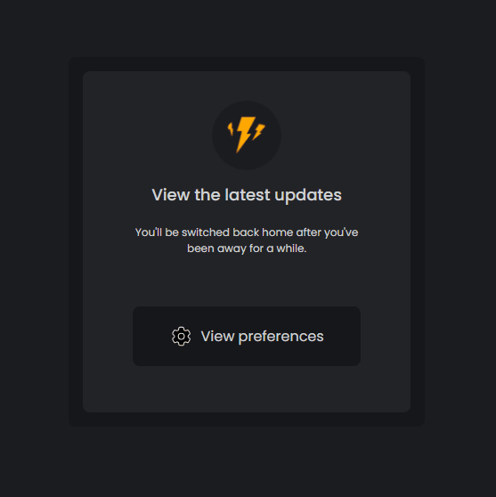

<h1 align="center">Updates Card Component</h1> 

  

  <h2><a href="https://veraenders.github.io/updates-card-component/">Live</a>
   |  
  <a href="https://github.com/VeraEnders/updates-card-component">Code</a></h2>
  
Challenge is provided by <a href="https://icodethis.com/">iCodeThis</a>.
 

## About the project
The Updates Card Component serves as a visual element to display the latest updates or notifications to users. 

<b>Visual effects:</b>
* The card fades in and slides up into view when the page loads. 

* The lightning image scales up and down repeatedly.

* The button changes its background color, and the cog icon scales upon hover.

## Built with
- HTML5
- CSS

## Author
GitHub - [VeraEnders](https://github.com/VeraEnders)